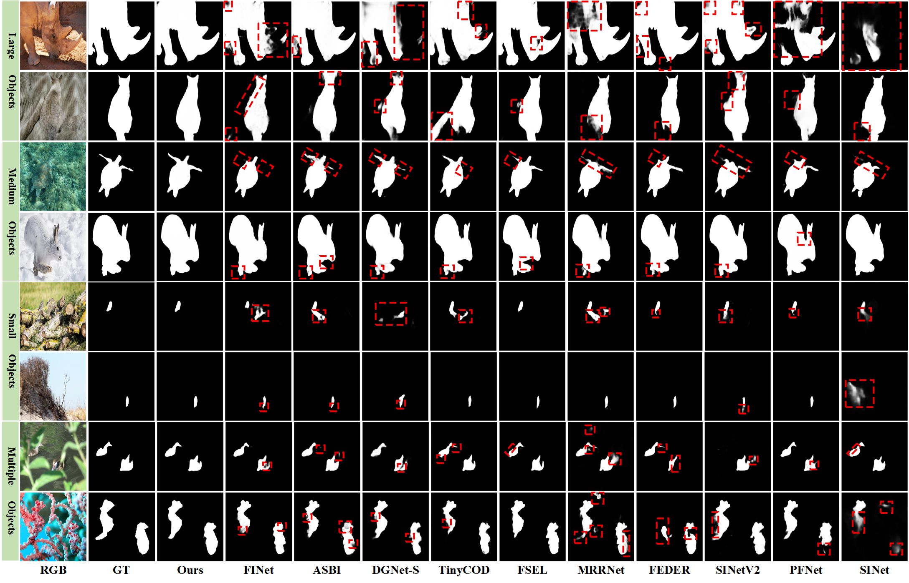
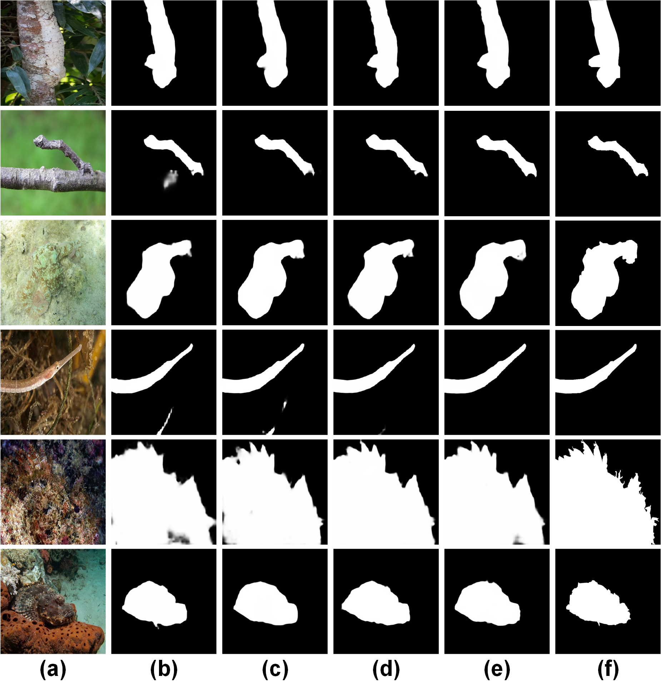

# Frequency-Guided Cross-Domain Learning for Lightweight Camouflaged Object Detection

[](#)
[](https://doi.org/10.5281/zenodo.20047495)
[](#license)

## 📌 Abstract

Camouflaged object detection (COD) faces challenges in preserving subtle structural cues due to weak boundaries and high background similarity. Existing methods often use loose fusion of frequency priors and spatial features, leading to unstable representation. This work presents a Frequency-aware Cross-domain Hierarchical Network (FCHNet) for efficient COD. The model integrates a Cross-domain Frequency Alignment module and Wavelet Feature Refinement to stabilize spatial-frequency coordination. A boundary-aware decoder further refines object contours. Experiments on CAMO, COD10K, and NC4K show FCHNet outperforms lightweight models by 3.1% in weighted F-measure with under 5M parameters, achieving efficiency and accuracy balance. 

---

## 🔗 Paper and Code Relationship

This repository contains the official implementation of the manuscript:

**Frequency-Guided Cross-Domain Learning for Lightweight Camouflaged Object Detection**

This code is directly related to a manuscript submitted to **The Visual Computer**.

If you use this code, trained weights, prediction maps, or experimental results in your research, please cite the related manuscript. The official citation information will be updated after the paper is accepted or published.

---

## 🌐 Permanent Resources

To improve transparency and reproducibility, we provide source code, trained models, prediction maps.

| Resource | Link | Extraction Code |
|---|---|---|
| FCHNet prediction maps | https://pan.baidu.com/s/1esOes8En-lfgAugIYQvs4A?pwd=wpe7 | wpe7 |
| FCHNet trained model | https://pan.baidu.com/s/1Iz02YaItxvPlpAuICyeblg?pwd=e4x4 | e4x4 |

---

## 🧠 Overall Architecture

FCHNet consists of the following key components:

- **EfficientNet-based Backbone**  
  Extracts lightweight multi-level visual features.

- **Wavelet Feature Refinement (WFR) Module**  
  Refines features through frequency-aware wavelet decomposition and attention.

- **Cross-domain Frequency Alignment (CFA) Module**  
  Aligns spatial-domain features and frequency-domain representations.

- **Boundary Feature Extraction (BFE) Module**  
  Extracts boundary-aware cues to enhance contour perception.

- **Boundary-guided Decoder (BGD)**  
  Progressively integrates semantic, frequency, and boundary information to generate accurate prediction maps.

---

## 🧩 Key Algorithms and Implementation Details

### 1. Wavelet Feature Refinement Module

The Wavelet Feature Refinement module decomposes feature maps into low-frequency and high-frequency components. The low-frequency component helps capture global semantic context, while the high-frequency component preserves texture, contour, and structural details.

This design is useful for camouflaged object detection because camouflaged targets usually have weak object boundaries and high similarity with their surroundings.

Related implementation files:

```text
Model/HTLBlock.py
Model/WHAtt.py
Model/WLAtt.py
```

---

### 2. Cross-domain Frequency Alignment Module

The Cross-domain Frequency Alignment module coordinates spatial-domain features and frequency-domain representations. It reduces unstable feature fusion caused by weak boundaries and complex background interference.

Related implementation file:

```text
Model/CFA.py
```

---

### 3. Boundary Feature Extraction Module

The Boundary Feature Extraction module introduces edge-aware information to enhance the perception of object contours. It provides additional boundary guidance for the decoder and helps generate sharper prediction maps.

Related implementation file:

```text
Model/EdgeFT.py
```

---

### 4. Boundary-guided Decoder

The Boundary-guided Decoder progressively fuses multi-level encoder features, refined frequency features, and boundary cues. It is designed to improve localization accuracy and recover fine object structures.

Related implementation file:

```text
Model/DeBlock.py
```

---

## 📂 Project Structure

```text
FCHNet/
├── Model/
│   ├── FCHNet.py          # Main model framework
│   ├── CFA.py             # Cross-domain Frequency Alignment module
│   ├── CoordAtt.py        # Coordinate Attention module
│   ├── DeBlock.py         # Boundary-guided Decoder module
│   ├── EdgeFT.py          # Boundary Feature Extraction module
│   ├── EfficientNet.py    # EfficientNet backbone
│   ├── GlobalAtt.py       # Global Attention module
│   ├── HTLBlock.py        # Wavelet refinement module
│   ├── Module.py          # Basic convolution modules
│   ├── RefineFM.py        # Transformer refinement module
│   ├── WHAtt.py           # High-frequency wavelet attention module
│   └── WLAtt.py           # Low-frequency wavelet attention module
│
├── utils/
│   ├── dataloader_freq.py
│   ├── data_augmentation.py
│   ├── dct.py
│   └── metrics.py
│
├── train.py
├── inference.py
├── evaluate.py
├── requirements.txt
└── README.md
```

---

## ⚙️ Requirements

The experiments were conducted under the following environment:

```text
Ubuntu 20.04
Python 3.8
PyTorch 1.10+
CUDA 11.3
torchvision
numpy
opencv-python
Pillow
tqdm
scipy
matplotlib
```

Install dependencies:

```bash
conda create -n fchnet python=3.8
conda activate fchnet
pip install -r requirements.txt
```

Example `requirements.txt`:

```text
torch>=1.10.0
torchvision
numpy
opencv-python
Pillow
tqdm
scipy
matplotlib
```

Please make sure that the installed PyTorch version is compatible with your CUDA version.

---

## 📊 Dataset Preparation

FCHNet is trained and evaluated on commonly used camouflaged object detection benchmarks:

- CAMO
- COD10K
- CHAMELEON
- NC4K

The training and testing datasets can be downloaded from publicly available COD dataset repositories, such as SINet-V2:

```text
https://github.com/GewelsJI/SINet-V2
```

Please organize the dataset as follows:

```text
dataset/
├── TrainDataset/
│   ├── Image/
│   ├── GT/
│   └── Edge/
│
└── TestDataset/
    ├── CAMO/
    │   ├── Image/
    │   └── GT/
    ├── COD10K/
    │   ├── Image/
    │   └── GT/
    ├── CHAMELEON/
    │   ├── Image/
    │   └── GT/
    └── NC4K/
        ├── Image/
        └── GT/
```

The `Edge/` folder contains edge maps generated from ground-truth masks. These edge maps are used for boundary supervision during training.

Please update the dataset paths in the configuration file or training script before running the code.

---

## 🚀 Training

Before training, please check and modify the following settings:

- Training dataset path
- Batch size
- Learning rate
- Number of epochs
- Checkpoint save path
- GPU device ID

Run:

```bash
python train.py
```

Recommended training settings:

```text
Input size: 384 × 384
Batch size: 32
Learning rate: 2.6e-4
Epochs: 100
Optimizer: Adam
```

The trained checkpoints will be saved in:

```text
checkpoints/FCHNet/
```

Example checkpoint path:

```text
checkpoints/FCHNet/FCHNet.pth
```

---

## 🔍 Inference

Run the following command to generate prediction maps:

```bash
python inference.py
```

Before inference, please make sure that the trained model path and testing dataset path are correctly configured.

The prediction maps will be saved in:

```text
prediction_maps/
```

Expected output structure:

```text
prediction_maps/
├── CAMO/
├── COD10K/
├── CHAMELEON/
└── NC4K/
```

---

## 📈 Evaluation

Run the following command to evaluate the prediction maps:

```bash
python evaluate.py
```

The evaluation metrics include:

- S-measure
- E-measure
- Weighted F-measure
- MAE
---
## 🏆 Overview

<p align="center">
  
</p>

<p align="center">
  <b>Figure 7.</b> Qualitative comparison of FCHNet with other COD methods.
</p>


## 🏆 Quantitative Results

The following table reports the performance of FCHNet on four COD benchmark datasets.

| Dataset | S-measure ↑ | E-measure ↑ | Weighted F-measure ↑ | MAE ↓ |
|---|---:|---:|---:|---:|
| CAMO | TODO | TODO | TODO | TODO |
| COD10K | TODO | TODO | TODO | TODO |
| CHAMELEON | TODO | TODO | TODO | TODO |
| NC4K | TODO | TODO | TODO | TODO |

Please replace `TODO` with the official results reported in the manuscript.

--

## 🖼️ Experimental Visualization and Analysis

To provide a more comprehensive understanding of the proposed FCHNet, we include qualitative comparisons, ablation studies, visualization results, and failure cases.

### Qualitative Comparison

The following figure shows qualitative comparison results between FCHNet and other representative camouflaged object detection methods.

<p align="center">
  
</p>

<p align="center">
  <b>Figure 7.</b> Qualitative comparison of FCHNet with other COD methods.
</p>

---

### Ablation Study

The following figure presents the ablation study of the main components in FCHNet. The results demonstrate the effectiveness of the proposed modules.

<p align="center">
  
</p>

<p align="center">
  <b>Figure 8.</b> Ablation analysis of the proposed components.
</p>

---

### Feature Visualization

The following figure visualizes the feature activation and heatmap responses of FCHNet. The visualization results show that FCHNet can focus more accurately on camouflaged objects and suppress background interference.

<p align="center">
  
</p>

<p align="center">
  <b>Figure 9.</b> Overview of heatmap visualization results.
</p>

---


## 🔁 Reproducibility Notes

To reproduce the reported results, please follow these steps:

1. Install the required environment.
2. Download and organize the training and testing datasets.
3. Prepare edge maps for boundary supervision.
4. Update dataset paths in the configuration file or training script.
5. Train FCHNet using `train.py`, or download the released trained model.
6. Run `inference.py` to generate prediction maps.
7. Run `evaluate.py` to calculate quantitative metrics.

## 📖 Citation

If you find this work useful for your research, please cite our related manuscript:

```bibtex
@article{fchnet2026,
  title={Frequency-Guided Cross-Domain Learning for Lightweight Camouflaged Object Detection},
  author={TODO and TODO and TODO},
  journal={The Visual Computer},
  year={2026},
  note={Under review}
}
```

The citation information will be updated after the manuscript is officially accepted or published.

---

## 📜 License

This repository is released for academic research purposes only.

Commercial use is not permitted without permission from the authors.

For other usage, please contact the authors.

---

## ✨ Acknowledgements

We sincerely thank the authors of previous camouflaged object detection works and publicly available datasets, including:

- CAMO
- COD10K
- CHAMELEON
- NC4K
- SINet
- SINet-V2

This project also benefits from previous studies on camouflaged object detection, frequency-domain learning, wavelet-based feature refinement, and boundary-aware segmentation.

---

## 📬 Contact

For any questions, please contact:

```text
carbonsir@126.com
```
